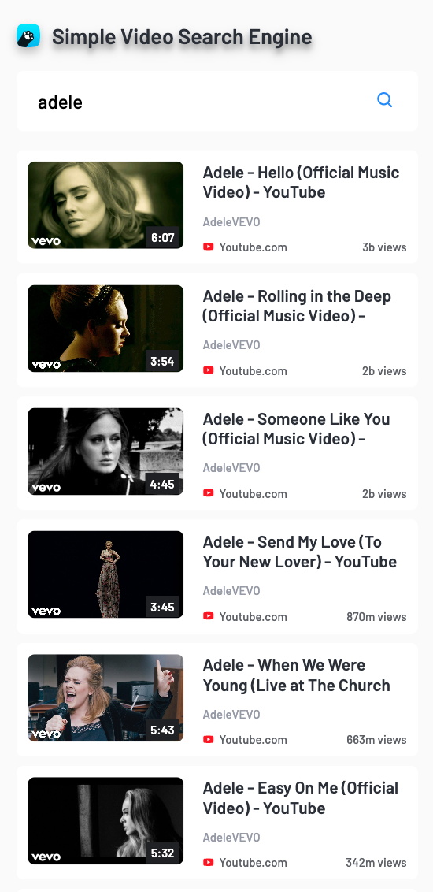
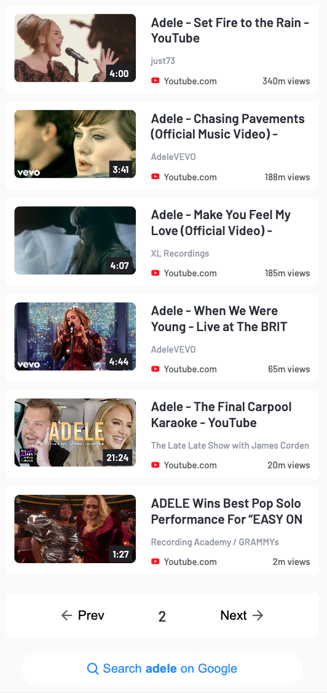
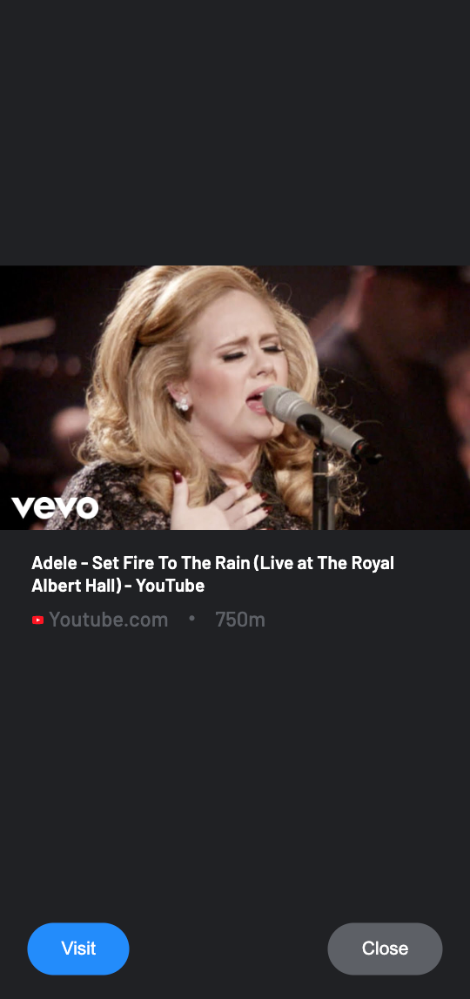

## Simple Video Search

---

**[The production link](https://iryna-zatynina.github.io/simple-video-search/)**

Search engine is fine-tuned to display video results from music categories and sorted based 
on popularity(in descending order by view count). Upon clicking a video, a preview overlay 
appears. The **"Visit"** button opens the video link in a new tab,
while the **"Close"** button simply closes the preview. A navigation area following the list of video results 
for users to traverse through the search result pages using **"Close"** and **"Close"** options

**Frontend:**

**Backend:**

---

### Some screenshots from the app:

---

_**Search results**_

_**Navigation:**_

_**Preview:**_

